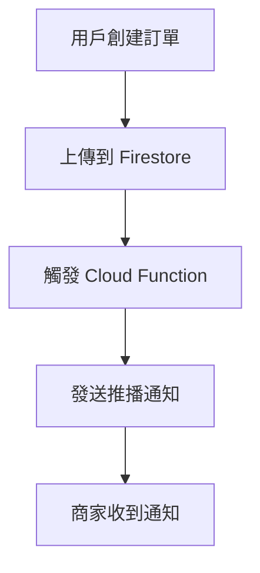

# 🔔 FlowerStudio 推播通知測試指南

## 重要說明 ⚠️

**模擬器限制**：iOS 模擬器無法接收真實的推播通知，因為它無法獲得 APNS (Apple Push Notification Service) token。要測試推播通知功能，必須使用真實的 iOS 設備。

## 測試準備

### 1. 設備要求
- 真實的 iOS 設備（iPhone 或 iPad）
- iOS 17.0 或更高版本
- 有效的網路連接

### 2. 開發者帳號設置
確保您的 Apple Developer 帳號已正確設置：
- Team ID: `5SM27L37HZ`
- APNs Key ID: `28FW72D5N8`
- Bundle ID: `com.flowerstudio.app`

## 測試步驟

### 第一步：在真實設備上運行應用
1. 將 iOS 設備連接到電腦
2. 在 Xcode 中選擇您的設備作為運行目標
3. 構建並運行應用程式

### 第二步：確認推播通知權限
1. 首次運行時，應用會請求推播通知權限
2. 點擊「允許」授予權限
3. 檢查日誌中是否顯示：`✅ 推播通知權限已獲得`

### 第三步：測試訂單創建
1. 在應用中創建一個新訂單（通過產品詳情頁面或購物車）
2. 填寫訂單資訊並提交
3. 檢查日誌中的訊息：
   ```
   📦 正在上傳訂單到 Firebase
   ✅ 訂單已成功上傳到 Firestore
   🔔 發送推播通知給商家
   ```

### 第四步：驗證 Cloud Functions
1. 打開 [Firebase Console](https://console.firebase.google.com/)
2. 進入您的專案：`flowerstudio-531e8`
3. 查看 Functions 頁面，確認函數已觸發
4. 檢查 Firestore 中的訂單資料

## 推播通知流程



## 測試用的手動推播

如果需要手動測試推播通知，可以使用以下方法：

### 方法一：使用 Firebase Console
1. 進入 Firebase Console
2. 選擇 Cloud Messaging
3. 創建新的推播通知
4. 目標設定為 `merchant_notifications` 主題

### 方法二：使用 Cloud Functions 測試函數
使用我們部署的測試函數：
```bash
# 在 cloud_functions 目錄中執行
firebase functions:shell

# 在 shell 中執行
testPushNotification()
```

## 故障排除

### 問題：收不到推播通知
**可能原因**：
1. 使用模擬器（不支援推播通知）
2. 未授予推播通知權限
3. 網路連接問題
4. APNS 設定問題

**解決方案**：
1. 使用真實設備
2. 重新安裝應用並授予權限
3. 檢查網路連接
4. 確認 Firebase 專案設定

### 問題：Bundle ID 不一致警告
**解決方案**：已修正專案設定，Bundle ID 現在統一為 `com.flowerstudio.app`

### 問題：FCM Token 獲取失敗
**原因**：模擬器無法獲得 APNS token
**解決方案**：必須在真實設備上測試

## 推播通知內容範例

當訂單創建成功時，商家會收到以下格式的推播通知：

```
標題：新訂單通知
內容：新訂單：FL202506218323，客戶：[客戶名稱]，金額：NT$ [金額]
```

## 下一步

1. **在真實設備上測試**：這是驗證推播通知功能的唯一方法
2. **監控 Firebase Console**：確認 Cloud Functions 正常運作
3. **檢查訂單資料**：確認 Firestore 中的資料完整性
4. **測試不同場景**：嘗試不同的訂單類型和金額

## 技術細節

- **Firebase 專案**：flowerstudio-531e8
- **Cloud Functions**：已部署 3 個函數
  - `sendOrderNotification`：自動觸發
  - `sendOrderStatusUpdate`：狀態更新觸發
  - `testPushNotification`：手動測試
- **推播主題**：`merchant_notifications`
- **支援的平台**：iOS 17.0+

---

如果在測試過程中遇到任何問題，請提供詳細的錯誤日誌以便進一步診斷。 